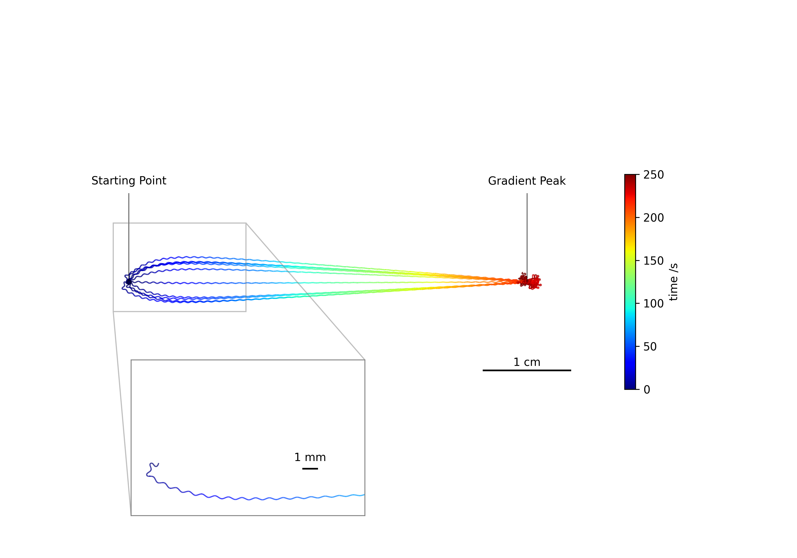

# README: C. elegans Chemotaxis Simulation

## 🧪 Associated Publication

Hironaka Masakatsu, Sumi Tomonari “A neural network model that generates salt concentration memory-dependent chemotaxis in *Caenorhabditis elegans*” *eLife* **14**:RP104456 (2025).
[DOI: 10.7554/eLife.104456.1](https://doi.org/10.7554/eLife.104456.1)

### 🧠 Abstract

> A neuroanatomical minimal network model was revisited to elucidate the mechanism of salt concentration memory-dependent chemotaxis observed in *Caenorhabditis elegans*. *C. elegans* memorizes the salt concentration during cultivation, manifesting a pronounced taste preference for this concentration. The right-side head sensory neuron, designated ASER, exhibits a response to a decrease in salt concentration. The basal level of glutamate transmission from ASER has been demonstrated to transiently increase and decrease when the current environmental salt concentrations are lower and higher, respectively, than that during previous cultivation. Given the sensitivity of excitatory/inhibitory glutamate receptors expressed on the postsynaptic AIY interneurons, it can be anticipated that the ASER-AIY synaptic transmission will undergo a reversal due to alterations in the basal glutamate release. The neural network, derived from the hypothesis, reproduced the salt concentration memory-dependent preference behavior and revealed that the circuit downstream of ASE functions as a module that is responsible for salt klinotaxis.

---

## 📁 Repository Structure

```text
118-oganesson-c_elegans_chemotaxis/
├── README.md                  # This file
├── Cargo.toml                 # Rust package configuration
├── *.toml                     # Configuration files for simulation and analysis
├── requirements.txt           # Python dependencies
├── data/                      # All experimental and simulation data
│   ├── experiment/            # Experimental behavioral data
│   ├── gene/                  # Genetic algorithm results and modifications
│   └── simulation/            # Output from simulations under various conditions
├── notebook/                  # Jupyter notebook example
├── scripts/                   # Python scripts for animation, plotting, etc.
└── src/                       # Rust source code
    ├── analysis/              # Analysis modules
    ├── genetic_algorithm/     # Genetic algorithm implementation
    └── simulation/            # Chemotaxis simulation engine
```

---

## 🚀 Getting Started

### Requirements

* Rust (edition 2021)
* Python 3.12+

Clone this repository:

```bash
git clone https://github.com/118-Oganesson/c_elegans_chemotaxis.git
cd c_elegans_chemotaxis
```

Build Rust components:

```bash
cargo build --release
```


Install Python dependencies:

```bash
pip install -r requirements.txt
```

---

## ⚙️ How to Run Simulations and Configure Settings

### Rust-based Simulation

The Rust entrypoint is `main.rs`, which accepts subcommands to perform specific tasks. Example usage:

```bash
cargo run --release -- <command>
```

Available commands:

* `ga-normal`: Genetic algorithm without constraints
* `ga-constrain`: Genetic algorithm with AIY-AIZ synapse constrained to be inhibitory
* `analysis`: Analysis of simulation results

Example:

```bash
cargo run --release -- ga-normal
```

Configuration for these simulations is handled through the following TOML files:

* `genetic_algorithm_setting.toml`: Parameters for GA-based optimization
* `klinotaxis_analysis_setting.toml`: Parameters for analyzing trajectory bias

### Python-based Visualization

Python scripts in the `scripts/` directory enable you to:

* Load data files (`load.py`)
* Create figures (`figure.py`)
* Animate trajectories (`animation.py`)

These scripts use settings defined in `python_scripts_setting.toml`, which specifies simulation and visualization parameters.

For an interactive example demonstrating how to use these scripts — including reproducing the figures used in our publication — please see the Jupyter notebook:

[`notebook/example.ipynb`](notebook/example.ipynb)

---

## 🗂️ Data Description

- [`data/gene/`](data/gene/): JSON files representing optimized neural parameters and variants  
  ↳ Documentation: [📄 `README_en.md`](data/gene/README_en.md) / [📄 `README_ja.md`](data/gene/README_ja.md)

- [`data/experiment/`](data/experiment/): Behavioral analysis results (corresponding to Fig. 5(d), Fig. 6(a), and Fig. S9(a)) under various salt concentrations and nutritional states, based on data from [(Kunitomo et al., 2013)](https://doi.org/10.1038/ncomms3210)

- [`data/simulation/`](data/simulation/): Results of simulations with various genetic and environmental conditions  
  ↳ Documentation: [📄 `README_en.md`](data/simulation/README_en.md) / [📄 `README_ja.md`](data/simulation/README_ja.md)


---

## 🌐 Web Application

***C. elegans* Simulator**
A lightweight browser-based simulator that visualizes chemotaxis behavior based on salt concentration memory.

Powered by **Rust** and **WebAssembly**, it runs fast and fully client-side. Users can adjust parameters and observe worm movement through **real-time animations**.

* ▶️ Try it online: [*C. elegans* Simulator](https://wormsim.streamlit.app/)
* 🧬 Source code: [GitHub Repository](https://github.com/118-Oganesson/WormSim)


---

## 📸 Sample Results

### Chemotactic Trajectory (Constrained by AIY-AIZ Neurons)



### Chemotactic Trajectory Animation

Individuals cultivated under **high** (top) and **low** (bottom) salt concentration conditions.


> 📎 *These results were generated and visualized using the scripts `figure.py` and `animation.py`.*

---

## 📖 Citation (BibTeX)

```bibtex
@article{Hironaka2025,
  author = {Hironaka, Masakatsu and Sumi, Tomonari},
  title = {A neural network model that generates salt concentration memory-dependent chemotaxis in Caenorhabditis elegans},
  journal = {eLife},
  volume = {14},
  pages = {RP104456},
  year = {2025},
  doi = {10.7554/eLife.104456.1}
}
```

---

## 🪪 Licensing

This repository is licensed under the MIT License.

---

## ✉️ Contact

**Tomonari Sumi**

* Email: [sumi@muroran-it.ac.jp](mailto:sumi@muroran-it.ac.jp)
* Lab website: [https://sites.google.com/view/mb-lab/home](https://sites.google.com/view/mb-lab/home)


